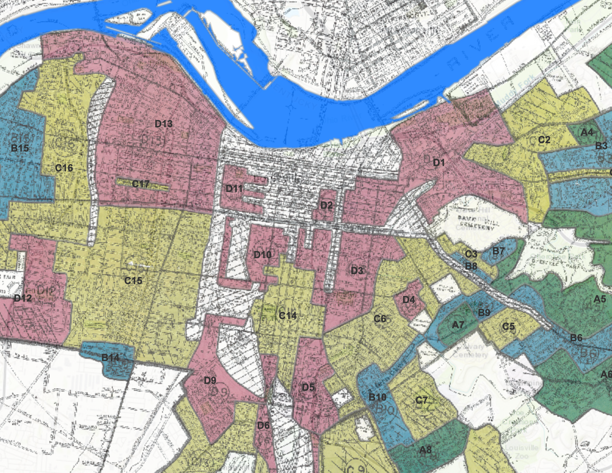
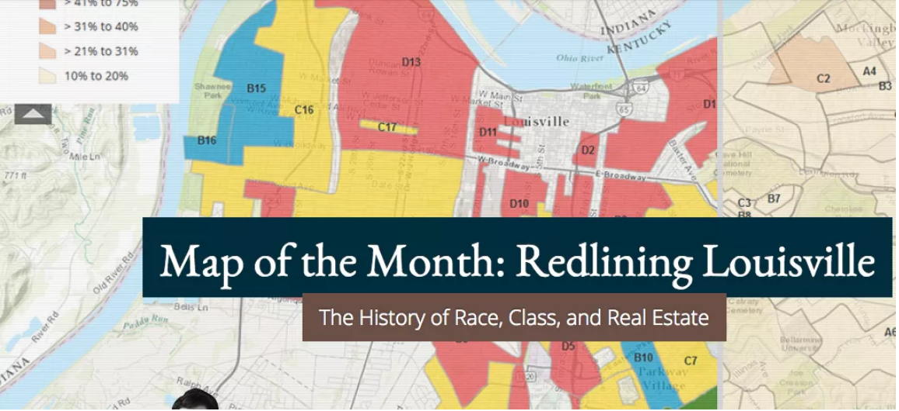
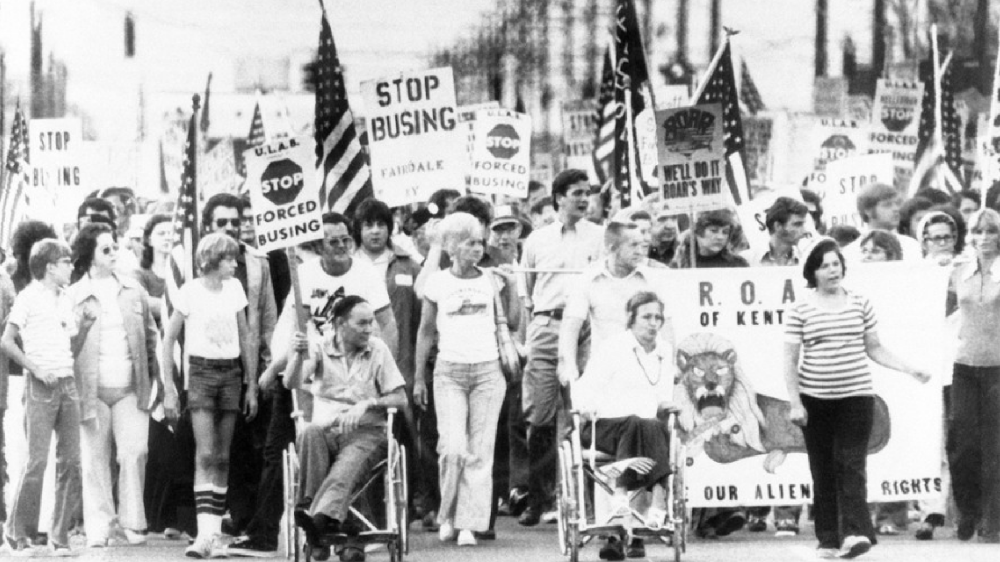
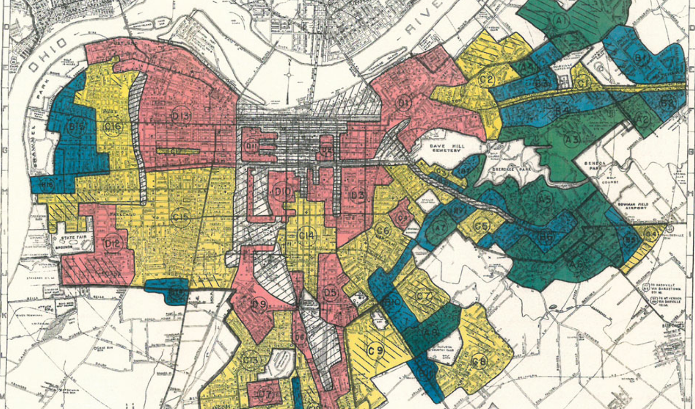
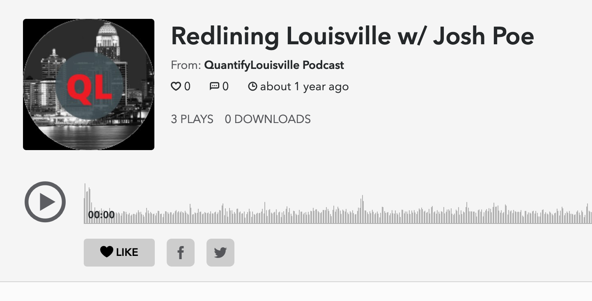

<section class="jumbotron text-center">
    

      <h1 class="jumbotron-heading">Newsfeed example</h1>
      
Testing the cms with this line.  Something short and leading about the collection below—its contents, the creator, etc. Make it short and sweet, but not too short so folks don’t simply skip over it entirely.

      

        <a href="#" class="btn btn-primary my-2">Main call to action</a>
        <a href="#" class="btn btn-secondary my-2">Secondary action</a>
      

    

  </section>

  

    

      

        

          

            
            

              <h5 class="card-title">Redlining Louisville Storymap</h5>
              
Redlining refers to the practice of denying loans in certain neighborhoods because of race or socioeconomic characteristics rather than physical, design, or structural characteristics...
 
              

                

                  <a href ="https://lojic.maps.arcgis.com/apps/MapSeries/index.html?appid=e4d29907953c4094a17cb9ea8f8f89de" target="_blank"><button type="button" class="btn btn-med btn-outline-primary">View Project</button></a>
                

                <small class="text-muted">9 mins</small>
              

            

          

        

        

          

            
            

              <h5 class="card-title">Redlining Louisville map wins Harvard University honor</h5>
              
“Redlining Louisville: The History of Race, Class and Real Estate” is the first selection by the Ash Center for Democratic Governance and Innovation at Harvard’s John F. Kennedy School of Government...

              

                

                  <a href ="https://insiderlouisville.com/government/redlining-louisville-map-wins-harvard-university-honor/" target="_blank"><button type="button" class="btn btn-med btn-outline-primary">Read More</button></a>
                

                <small class="text-muted">9 mins</small>
              

            

          

        

        

          

            
            

              <h5 class="card-title">Mapping Louisville's Redlining History - CityLab</h5>
              
"...As the website for the new online mapping project Redlining Louisville states, “These slave pens represent the origins of the black residential experience in Louisville"...

              

                

                 <a href ="https://www.citylab.com/equity/2017/02/louisville-confronts-its-redlining-past-and-present/517125/" target="_blank"><button type="button" class="btn btn-med btn-outline-primary">Read More</button></a>
                

                <small class="text-muted">9 mins</small>
              

            

          

        

        

          

            
            

              <h5 class="card-title">Louisville's Dividing Lines: The Results of Redlining In The City</h5>
              
"Poe’s project illustrates how many neighborhoods that were targeted for disinvestment now still shoulder poverty, low property values and a greater percentage of mortgage denials than other parts of Jefferson County"...

              

                

                 <a href ="https://www.louisville.com/content/dividing-lines" target="_blank"><button type="button" class="btn btn-med btn-outline-primary">Read More</button></a>
                

                <small class="text-muted">9 mins</small>
              

            

          

        

        

          

            <iframe class="bd-placeholder-img card-img-top" width="100%" height="200" src="https://www.youtube.com/embed/QzqffSDbzqk" frameborder="0" allow="accelerometer; autoplay; encrypted-media; gyroscope; picture-in-picture" allowfullscreen></iframe>
            

              <h5 class="card-title">Mapping Louisville's Redlining History - CityLab</h5>
              
"Redlining dates back to 1933, when the U.S. government created the Home Owner’s Loan Corporation (HOLC) to bolster the housing market and homeownership opportunities across the nation”...

              

                

                 <a href ="https://www.youtube.com/watch?v=QzqffSDbzqk&feature=youtu.be" target="_blank"><button type="button" class="btn btn-med btn-outline-primary">Watch Video</button></a>
                

                <small class="text-muted">9 mins</small>
              

            

          

        

        

          

            
            

              <h5 class="card-title">Quantify Louisville Podcast</h5>
              
Michael and Eric interview Josh Poe - independent researcher and activist (and map-builder extraordinaire) about his work on the award-winning Redlining Louisville project. We get into the history of redlining, and the long-last economic effects it has had on our city...

              

                

                 <a href ="https://www.spreaker.com/user/10014431/redlining-louisville-w-josh-poe" target="_blank"><button type="button" class="btn btn-med btn-outline-primary">Play Episode</button></a>
                

                <small class="text-muted">9 mins</small>
              

            

          

        

      

    

  

